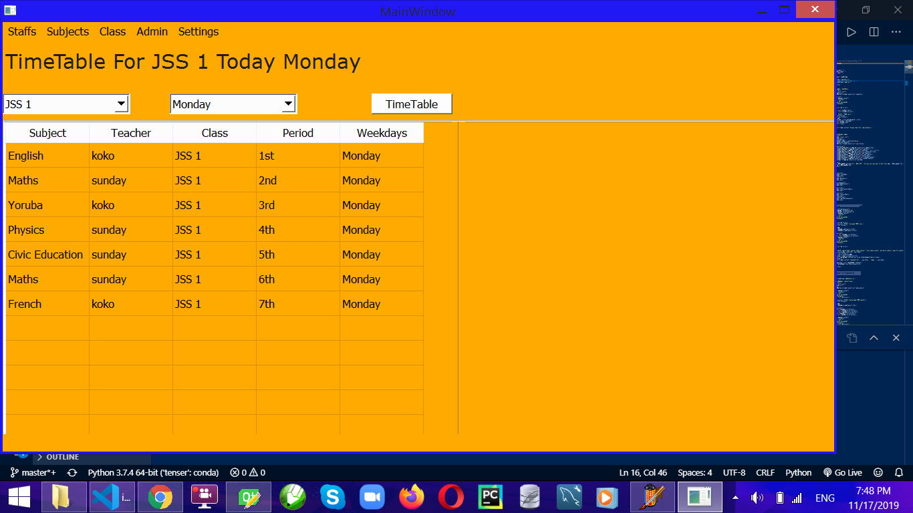
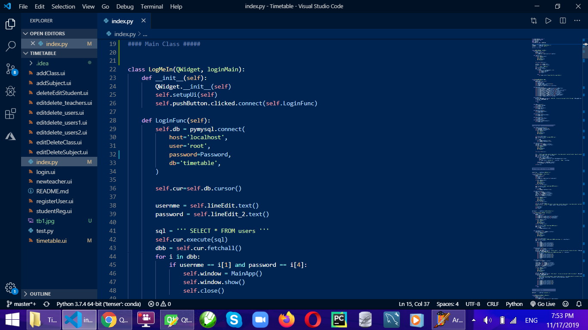
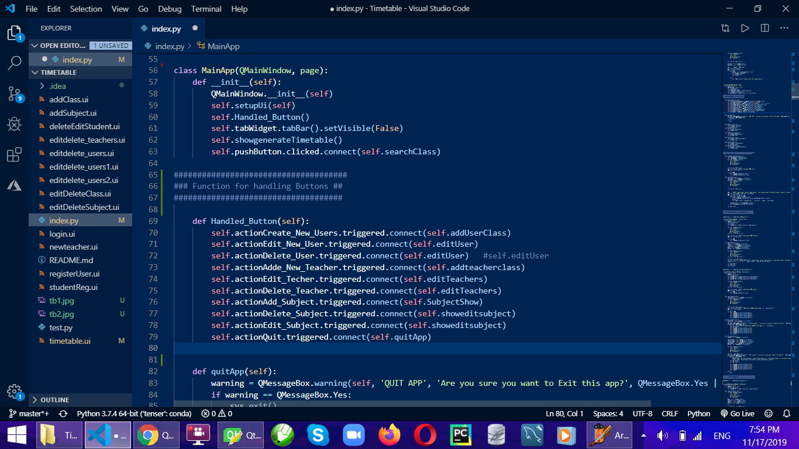
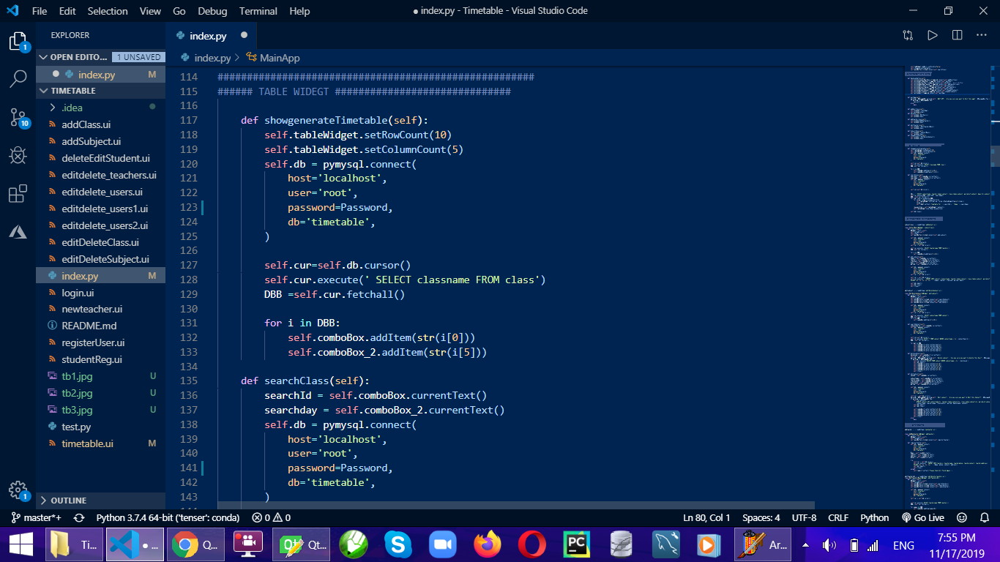
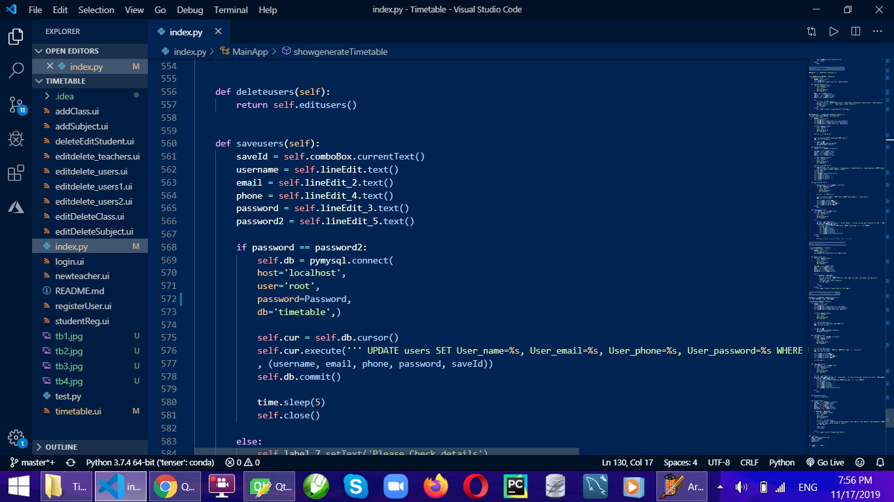
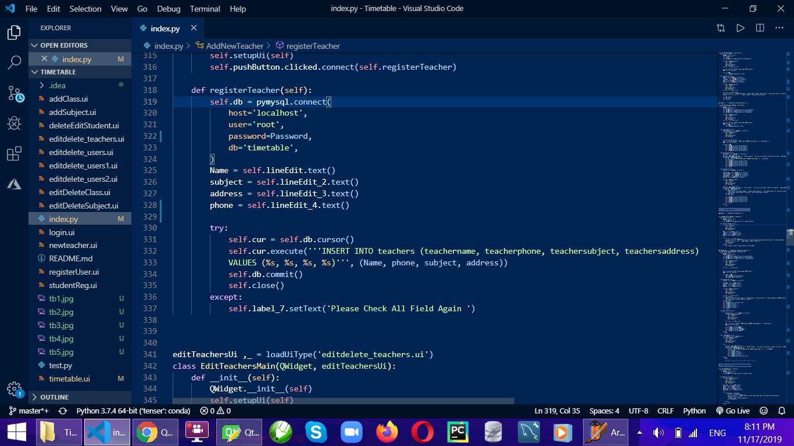
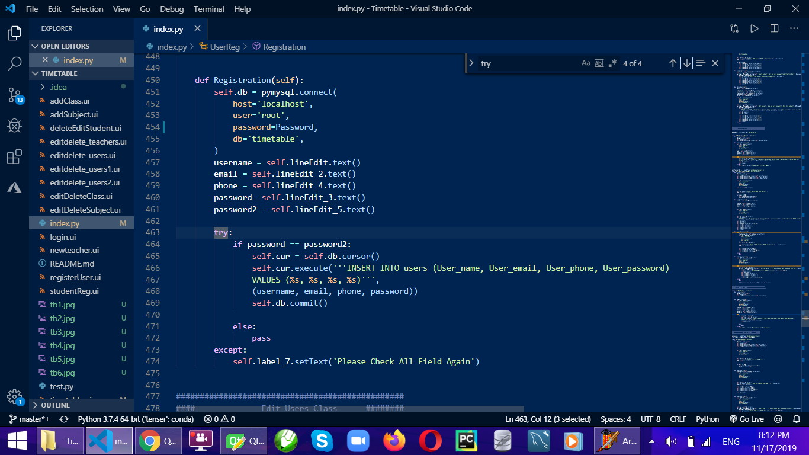

# Welcome ! 
## Many Schools and College Uses a Manuel Means to schedule timetable leading to Subject/ Course Clashing and might take several days to Change and correct this, here is A simple TimeTable generator software for schools.

# Features
 - Create User
 - Edit User and Delete Users
 ---
 - Create teachers 
 - Edit na Delete Teachers
 ---
 - Add Subject
 - Edit and delete Subject
---
- Add Class
- Edit and Delete Class
## MORE OPTION TO BE ADDED ON DEMAND

# ScreenShot 

[EMAIL](sundayafolabi992@gmail.com)
[LINKEDIN](https://www.linkedin.com/in/afolabisunday/)